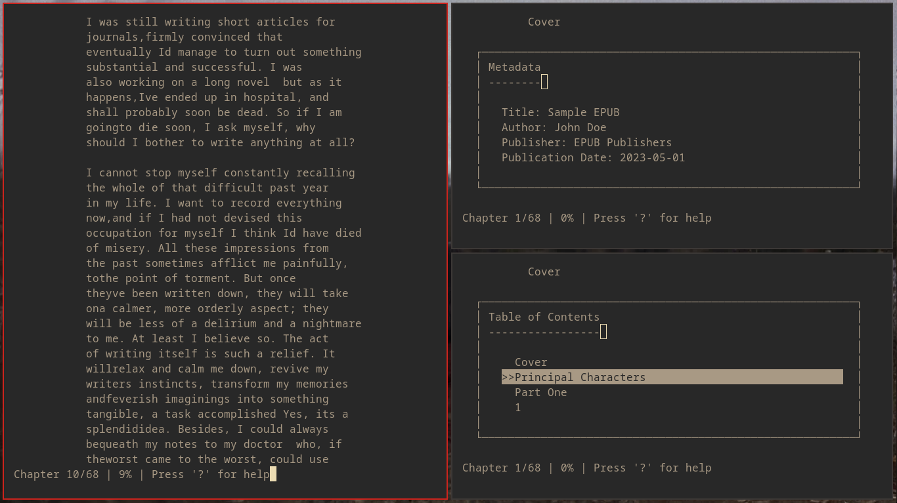

# `$ solivagant`


# What is this project?

As a fan of 'epr' and 'epy', I found myself wanting something different. I wasn't keen on it's Python implementation, as I've grown accustomed to C and its capabilities while using Linux. My goal was to create a minimalistic command-line EPUB reader because reading EPUBs shouldn't be a bloated affair—wink wink, Foliate! Just kidding, I love Foliate. 

So, I took 'epr' and rewrote it in C. It compiles easily with 'make' and can reside in your suckless programs folder since it requires only four dependencies, well three dependencies since one is preinstalled to run and is 1181 lines of code. If you're looking for a lightweight, terminal-based EPUB reading experience in linux, this project is designed for you!

# What To Expect

solivagant is a converted implementation of EPR and EPY written in C. It handles EPUB parsing, fetching, and displaying content in the terminal. While I’m not a programmer, I can say that it allows you to read EPUB files, but it does so in a rather dull manner. Think of it as a simple tool for reading ebooks without any extra features or flair. There are features specified in the various *.c and *.h files that might or might not work.

This project is a rewrite of the original application, focusing on core functionality rather than advanced features. Currently, it allows users to open and display various EPUB files, although the formatting may not be optimal and the interface is quite basic. While it lacks features like bookmarking, speed reading, and extensive keybinds and features found in epr/epy, it successfully fulfills its primary purpose of providing a straightforward reading experience. This build prioritizes essential capabilities, and while it may not be polished or feature-rich, it effectively meets the basic needs of EPUB terminal/CLI reading for now.

## About the name

The journey to name this project was a wandering path of its own. Initially, I considered "epr-c" as a nod to the original project and to indicate its implementation in C. However, as the project evolved, I felt it needed a name that better captured its essence and purpose.

After much contemplation, I settled on "Solivagant." This beautiful, obscure word perfectly encapsulates the experience of using this epub reader:

1. **Meaning**: Solivagant means "wandering alone" or "a solitary wanderer."

2. **Etymology**: It comes from Latin "solivagus," combining "solus" (alone) and "vagari" (to wander).

3. **Why it fits**:
   - Reading is often a solitary activity, a personal journey through worlds of words.
   - Using a CLI reader is a more independent, "wandering" way to explore books compared to GUI applications.
   - It evokes the idea of freely navigating through literature, choosing one's own path.
   - The obscurity of the word mirrors the nature of CLI tools - not mainstream, but powerful for those who seek them out.

"Solivagant" represents not just an epub reader, but a tool for solitary literary journeys. It's an invitation to wander alone through digital pages, embarking on adventures of the mind.

In choosing this name, I hope to intrigue users, encouraging them to look up its meaning and, in doing so, begin their journey of discovery even before they start reading their first book with this tool.

# Features

- Dynamic terminal resizing with automatic ncurses refresh
- Customizable settings via config.h (some features are placeholders)
- Desktop integration with solivagant.desktop for easy epub launching
- Makefile for installation, uninstallation, and cleaning
- Up-to-date screenshot showcasing current appearance
- Installation of a solivagant.1
- Built in Light and Dark Colorschemes Switching
- Basic epub reading functionality:
  - On-screen keybind display
  - Table of contents navigation
- Planned improvements For The Future:
  - Fix formatting issues
  - Implement bookmarking
  - Add more keybindings
  - Possible support for txt files
  - Speed Reading Support

## Known Issues and Behavior

# Resolved Issues
    Fixed: Previously, certain EPUB files failed to open. This problem has been addressed and resolved.
	Fixed: Solivagant now dynamically adjusts to terminal size changes in ncurses and wraps the text accordingly.
	    
# Expected Variations
    EPUB Display Differences: Due to the diverse structuring of HTML and CSS in various EPUB files, the appearance may vary:
      Paragraph formatting (indentation and breaks) might not be consistent across all files
      Chapter separations may not always be visible, especially if defined by HTML
      Chapter indicators at the top of pages may sometimes be absent
      Titles and chapter numbers might appear merged in some instances
	  Dropcap letters and words are treated separately from the paragraph
	  
# Important Note
While I try to strive for consistency, the vast array of EPUB formatting styles means that each file may display uniquely. However, rest assured that all types of EPUB files are supported and will render in some form within the application.
	
## Dependencies

### Debian/Ubuntu/Pop_OS/Devuan
`sudo apt install make build-essential libjson-c-dev libncurses-dev libzip-dev libxml2-dev`

### Fedora/Nobara/AlmaLinux OS/RHEL/CentOS
`sudo dnf install make gcc json-c-devel ncurses-devel libzip-devel libxml2-devel`

### Arch Linux/ArcoLinux/Artix/CachyOS/Garuda/Manjaro
`sudo pacman -S make gcc json-c ncurses libzip libxml2`

### openSUSE/Gecko
`sudo zypper install make gcc libjson-c-devel ncurses-devel libzip-devel libxml2-devel`

### Alpine Linux
`sudo apk add make gcc musl-dev json-c-dev ncurses-dev libzip-dev libxml2-dev`

### Gentoo
`sudo emerge --ask sys-devel/make sys-devel/gcc sys-devel/binutils dev-libs/json-c sys-libs/ncurses dev-libs/libzip dev-libs/libxml2`

### Void Linux
`sudo xbps-install -Sy make base-devel json-c-devel ncurses-devel libzip-devel libxml2-devel`

### Solus
`sudo eopkg install make gcc json-c-devel ncurses-devel libzip-devel libxml2-devel`

### FreeBSD
`doas pkg install gmake gcc json-c ncurses libzip libxml2`

### OpenBSD
`doas pkg_add make libncurses-dev jansson libxml`

### Package Purposes:
- `make`: Used to automate the compilation and building process of the EPUB reader
- `gcc` (part of `build-essential`): Compiles the C source code of the EPUB reader
- `libjson-c-dev`: Handles JSON data for storing and manipulating EPUB metadata
- `libncurses-dev`: Creates the text-based user interface for the EPUB reader in the terminal
- `libzip-dev`: Reads and extracts content from EPUB files, which are essentially ZIP archives
- `libxml2-dev`: Parses XML files within EPUBs, such as the content.opf and container.xml files

## Installation

  - Via Git Cloning or Releases

    ```shell
    $ make && sudo make clean install 
    ```

## Usage
  - Terminal:
		`solivagant <epub_file>`
  
  - Graphically:
		`Right-click an EPUB, select 'solivagant' to open it, and ensure your terminal is set in the solivagant.desktop file.`

## Inspirations

- https://github.com/wustho/epr
- https://github.com/wustho/epy
- https://github.com/wustho/baca
